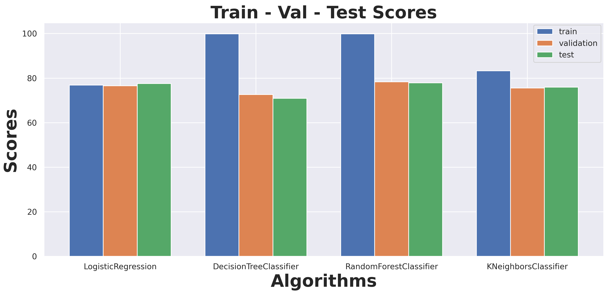

## Analysis of the HR Analytics

The purpose of this project would be to help a company reduce the cost and time invested into of candidates which are likely to seek employment elsewhere after they would have gone through initial training and onboarding.

Blue - Train, Orange - Validation, Green - Test

To start exploring this goal, I initially used a linear regression model, then added decisiontree, randomforest and knn. The figure depicts baseline scores for the various models.

This result suggests that logistic regression will give the most stable classification when testing on unseen data.